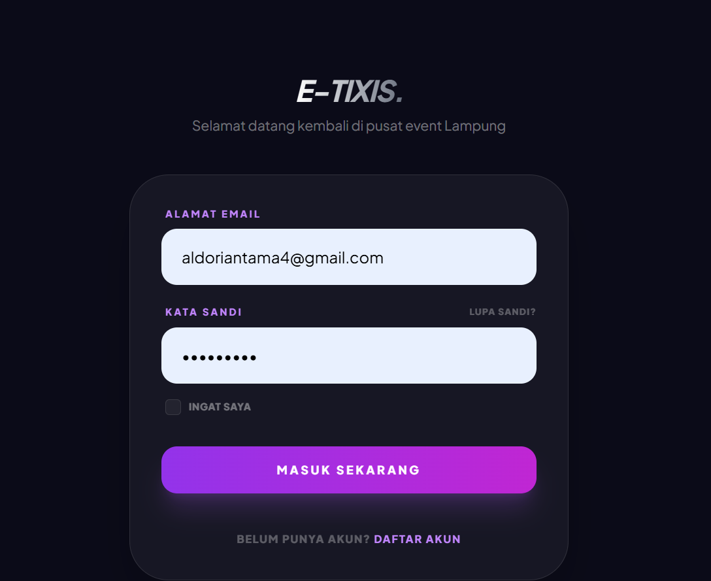
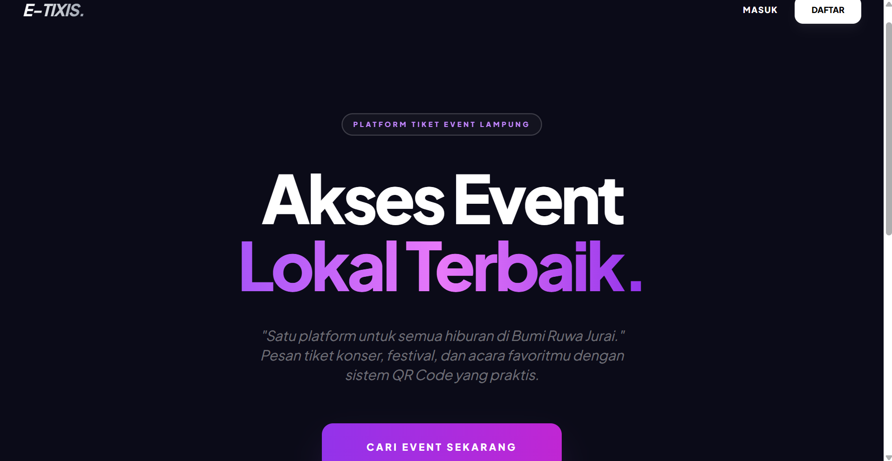
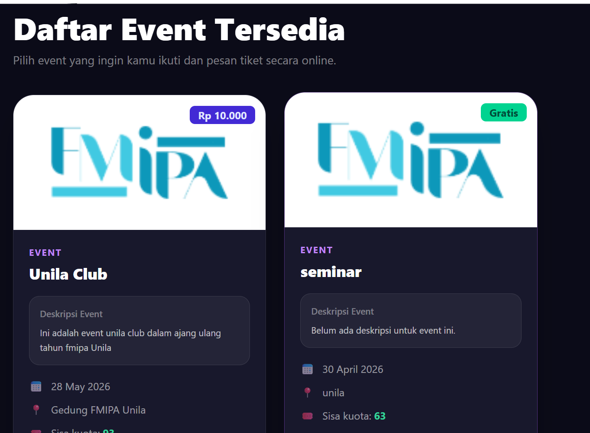
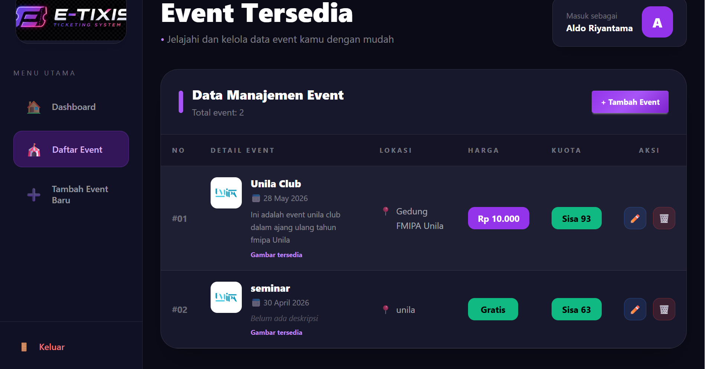
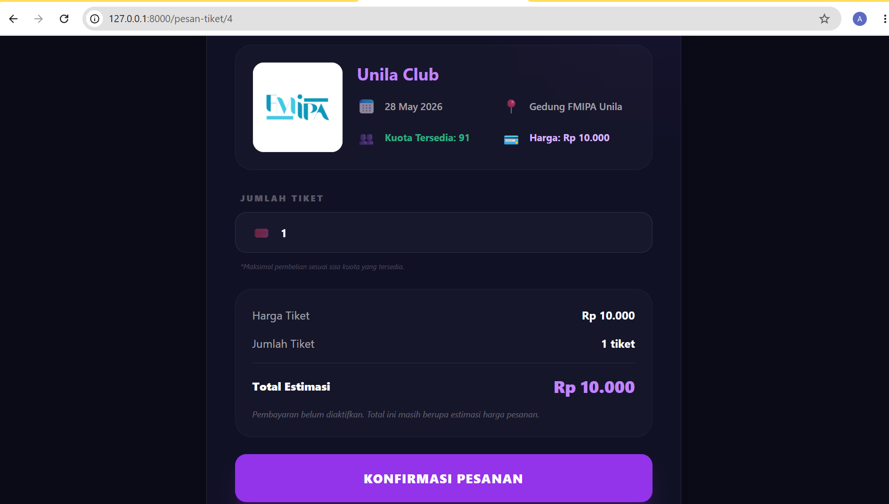
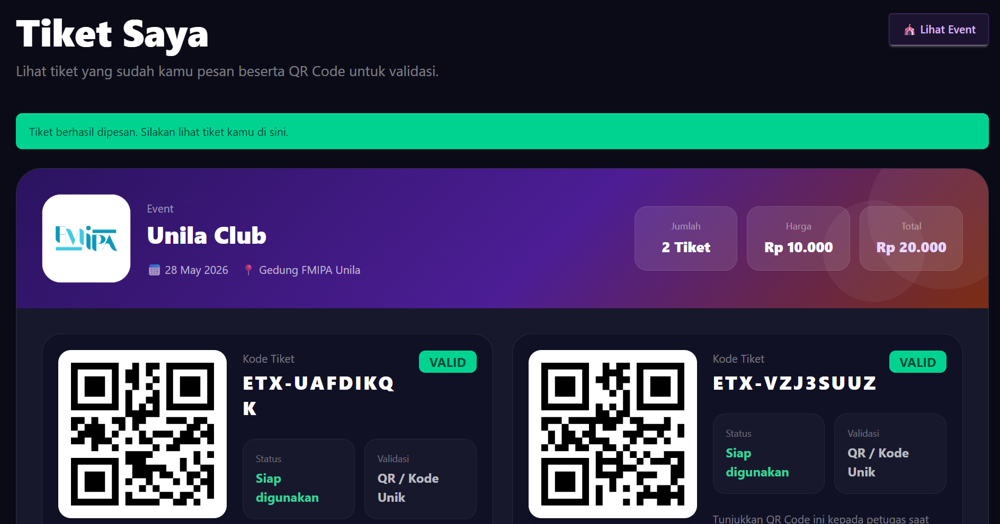
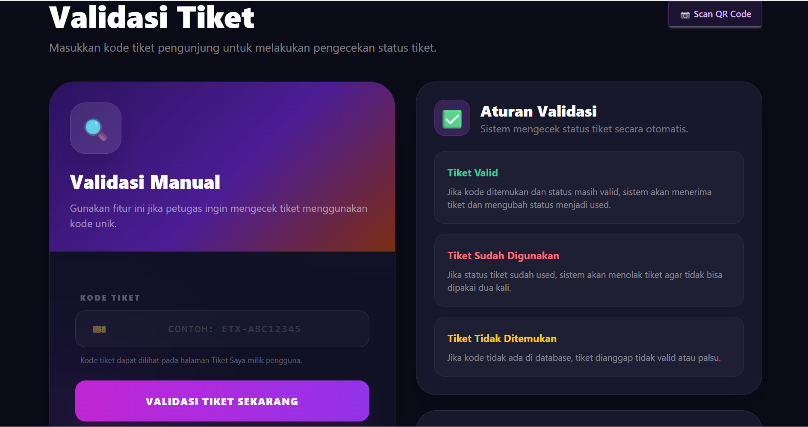
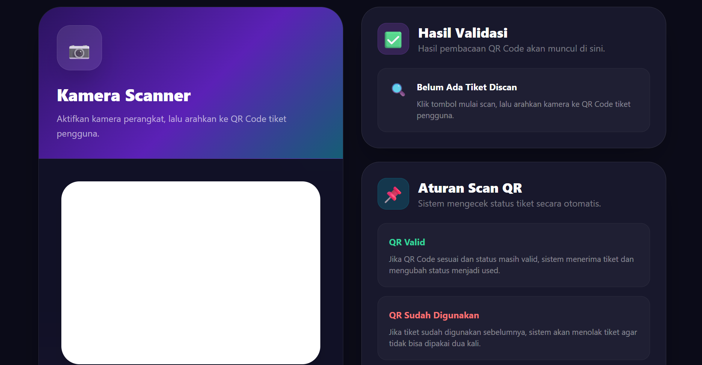

# E-TIXIS - Web Based Event Ticketing System

E-TIXIS adalah aplikasi web ticketing berbasis Laravel yang dibuat untuk membantu proses pengelolaan event, pemesanan tiket, pembuatan tiket digital, dan validasi tiket secara digital.

Sistem ini memiliki tiga role utama, yaitu **Admin**, **User**, dan **Petugas**. Admin bertugas mengelola data event, User dapat melihat event dan memesan tiket, sedangkan Petugas dapat melakukan validasi tiket melalui kode unik maupun QR Code.

Project ini dikembangkan sebagai implementasi pengembangan aplikasi web berbasis database menggunakan Laravel dan MySQL.

---

## Fitur Utama

* Autentikasi pengguna melalui login dan register
* Role pengguna: Admin, User, dan Petugas
* Admin dapat menambah, mengedit, dan menghapus event
* Admin dapat mengunggah gambar event
* Admin dapat menambahkan deskripsi event
* Admin dapat mengatur harga dan kuota tiket
* User dapat melihat daftar event yang tersedia
* User dapat melihat detail event sebelum melakukan pemesanan
* User dapat melakukan pemesanan tiket berdasarkan jumlah tiket
* Sistem menghitung total harga tiket secara otomatis
* Sistem menghasilkan kode unik untuk setiap tiket
* Sistem menghasilkan QR Code untuk setiap tiket
* User dapat melihat daftar tiket yang telah dipesan
* Petugas dapat melakukan validasi tiket secara manual
* Petugas dapat melakukan validasi tiket melalui scan QR Code
* Status tiket berubah dari valid menjadi used setelah divalidasi

---

## Teknologi yang Digunakan

* Laravel
* Laravel Breeze
* PHP
* MySQL
* Blade Template
* Tailwind CSS
* DaisyUI
* JavaScript
* Vite
* Simple QR Code
* HTML5 QR Code Scanner
* Laragon
* phpMyAdmin
* Visual Studio Code

---

## Role Pengguna

| Role    | Hak Akses                                                             |
| ------- | --------------------------------------------------------------------- |
| Admin   | Mengelola data event, gambar event, deskripsi, harga, dan kuota tiket |
| User    | Melihat daftar event, memesan tiket, dan melihat tiket milik sendiri  |
| Petugas | Melakukan validasi tiket manual dan scan QR Code tiket                |

---

## Struktur Fitur

```text
Login / Register
        |
        v
Dashboard
        |
        |-- Admin
        |      |-- Kelola Event
        |      |-- Tambah Event
        |      |-- Edit Event
        |      |-- Hapus Event
        |
        |-- User
        |      |-- Lihat Daftar Event
        |      |-- Pesan Tiket
        |      |-- Tiket Saya
        |
        |-- Petugas
               |-- Validasi Tiket Manual
               |-- Scan QR Code Tiket
```

---

## Tampilan Aplikasi

### Halaman Login



### Beranda / Dashboard



### Daftar Event



### Kelola Event Admin



### Pesan Tiket



### Tiket Saya



### Validasi Tiket Manual



### Scan Tiket



---

## Akun Demo

Gunakan akun berikut untuk mencoba sistem setelah menjalankan migration dan seeder.

| Role    | Email                                           | Password |
| ------- | ----------------------------------------------- | -------- |
| Admin   | [admin@etixis.com](mailto:admin@etixis.com)     | password |
| User    | [user@etixis.com](mailto:user@etixis.com)       | password |
| Petugas | [petugas@etixis.com](mailto:petugas@etixis.com) | password |

---

## Cara Menjalankan Project

### 1. Clone Repository

```bash
git clone https://github.com/Aldo233/e-tixis.git
```

### 2. Masuk ke Folder Project

```bash
cd e-tixis
```

### 3. Install Dependency Laravel

```bash
composer install
```

### 4. Install Dependency Frontend

```bash
npm install
```

### 5. Salin File Environment

Untuk Windows:

```bash
copy .env.example .env
```

Untuk Linux / Mac:

```bash
cp .env.example .env
```

### 6. Generate Application Key

```bash
php artisan key:generate
```

### 7. Atur Konfigurasi Database

Buka file `.env`, lalu sesuaikan konfigurasi database.

```env
DB_CONNECTION=mysql
DB_HOST=127.0.0.1
DB_PORT=3306
DB_DATABASE=e_tixis
DB_USERNAME=root
DB_PASSWORD=
```

Jika menggunakan Laragon dan port MySQL berbeda, sesuaikan bagian `DB_PORT`.

### 8. Jalankan Migration dan Seeder

```bash
php artisan migrate --seed
```

### 9. Buat Storage Link

Perintah ini digunakan agar gambar event yang diupload dapat tampil di browser.

```bash
php artisan storage:link
```

### 10. Jalankan Vite

```bash
npm run dev
```

### 11. Jalankan Server Laravel

Buka terminal baru, lalu jalankan:

```bash
php artisan serve
```

### 12. Buka Aplikasi

Buka aplikasi melalui browser:

```text
http://127.0.0.1:8000
```

---

## Catatan Penting

Jika gambar event tidak muncul setelah project dijalankan di perangkat lain, jalankan perintah berikut:

```bash
php artisan storage:link
```

File gambar hasil upload tersimpan di folder:

```text
storage/app/public/event-images
```

File gambar yang diupload dari perangkat lokal tidak otomatis ikut terbawa melalui GitHub. Jika ingin menampilkan gambar lama di perangkat lain, file gambar perlu disalin manual ke folder yang sama.

---

## Alur Penggunaan Sistem

1. Admin login ke sistem.
2. Admin menambahkan data event, seperti nama event, tanggal, lokasi, deskripsi, kuota, harga, dan gambar event.
3. User login dan melihat daftar event yang tersedia.
4. User memilih event dan melakukan pemesanan tiket.
5. Sistem membuat tiket digital dengan kode unik dan QR Code.
6. User dapat melihat tiket pada halaman Tiket Saya.
7. Petugas login ke sistem.
8. Petugas melakukan validasi tiket secara manual atau melalui scan QR Code.
9. Tiket yang berhasil divalidasi akan berubah status dari valid menjadi used.

---

## Status Project

Project ini sudah dapat dijalankan secara lokal dan memiliki fitur utama untuk pengelolaan event, pemesanan tiket, pembuatan tiket digital, serta validasi tiket manual dan scan QR Code.

---

## Video Demo

Video demo aplikasi akan ditambahkan pada bagian ini.

```text
Link video demo: https://youtu.be/QuL_apLB9mA
```

---

## Developer

* Aldo Riyantama
* Delvina Nurahmatika
* Aisha Indha Fajrani

Mahasiswa Teknik Informatika
Universitas Lampung

GitHub: [Aldo233](https://github.com/Aldo233)
